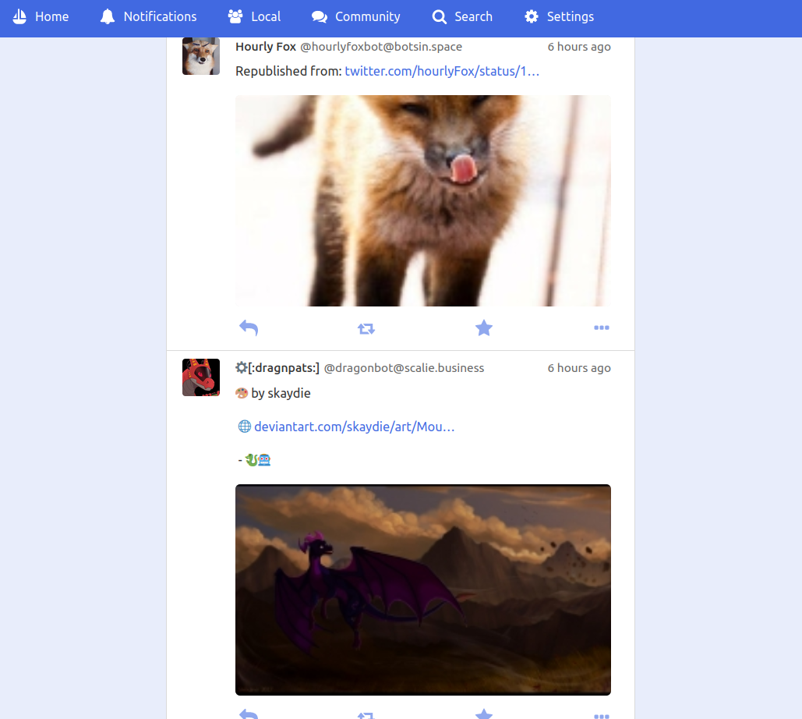

# GoToSocial <!-- omit in toc -->

GoToSocial is an [ActivityPub](https://activitypub.rocks/) social network server, written in Golang.

With GoToSocial, you can keep in touch with your friends, post, read, and share images and articles. All without being tracked or advertised to!

  

**GoToSocial is still [ALPHA SOFTWARE](https://en.wikipedia.org/wiki/Software_release_life_cycle#Alpha)**. It is already deployable and useable, and it federates cleanly with many other Fediverse servers (not yet all). However, many things are not yet implemented, and there are plenty of bugs! We foresee entering beta somewhere in 2023.

Documentation is at [docs.gotosocial.org](https://docs.gotosocial.org). You can skip straight to the API documentation [here](https://docs.gotosocial.org/en/latest/api/swagger/). To build from source, check the [CONTRIBUTING.md](./CONTRIBUTING.md) file.

Here's a screenshot of the instance landing page!

## Table of Contents <!-- omit in toc -->

- [What is GoToSocial?](#what-is-gotosocial)
  - [Federation](#federation)
  - [History and Status](#history-and-status)
- [Features](#features)
  - [Mastodon API compatibility](#mastodon-api-compatibility)
  - [Granular post settings](#granular-post-settings)
  - [Customizability for admins](#customizability-for-admins)
  - [Easy to run](#easy-to-run)
  - [Safety + security features](#safety--security-features)
  - [Various federation modes](#various-federation-modes)
  - [OIDC integration](#oidc-integration)
  - [Backend-first design](#backend-first-design)
- [Wishlist](#wishlist)
- [Getting Started](#getting-started)
- [Third-Party Packaging](#third-party-packaging)
- [Known Issues](#known-issues)
  - [Client App Issues](#client-app-issues)
  - [Federation Issues](#federation-issues)
- [Contributing](#contributing)
- [Building](#building)
- [Contact](#contact)
- [Credits](#credits)
  - [Libraries](#libraries)
  - [Image Attribution](#image-attribution)
  - [Team](#team)
  - [Special Thanks](#special-thanks)
- [Sponsorship + Funding](#sponsorship--funding)
  - [OpenCollective](#opencollective)
  - [LiberaPay](#liberapay)
  - [Provisos](#provisos)
- [License](#license)

## What is GoToSocial?

GoToSocial provides a lightweight, customizable, and safety-focused entryway into the [Fediverse](https://en.wikipedia.org/wiki/Fediverse), and is comparable to (but distinct from) existing projects such as [Mastodon](https://joinmastodon.org/), [Pleroma](https://pleroma.social/), [Friendica](https://friendi.ca), and [PixelFed](https://pixelfed.org/).

If you've ever used something like Twitter or Tumblr (or even Myspace!) GoToSocial will probably feel familiar to you: You can follow people and have followers, you make posts which people can favourite and reply to and share, and you scroll through posts from people you follow using a timeline. You can write long posts or short posts, or just post images, it's up to you. You can also, of course, block people or otherwise limit interactions that you don't want by posting just to your friends.

**GoToSocial does NOT use recommendation algorithms or collect data about you to suggest content or 'improve your experience'**. The timeline is chronological: whatever you see at the top of your timeline is there because it's *just been posted*, not because it's been selected as interesting (or controversial) based on your personal profile.

GoToSocial is not designed for 'must-follow' influencers with tens of thousands of followers, and it's not designed to be addictive. Your timeline and your experience are shaped by who you follow and how you interact with people, not by metrics of engagement!

GoToSocial doesn't claim to be *better* than any other application, but it offers something that might be better *for you* in particular.

### Federation

Because GoToSocial uses [ActivityPub](https://activitypub.rocks/), you can hang out not just with people on your home server, but with people all over the [Fediverse](https://en.wikipedia.org/wiki/Fediverse), seamlessly.

Federation means that your home server is part of a network of servers all over the world that all communicate using the same protocol. Your data is no longer centralized on one company's servers, but resides on your own server and is shared — as you see fit — across a resilient web of servers run by other people.

This federated approach also means that you aren't beholden to arbitrary rules from some gigantic corporation potentially thousands of miles away. Your server has its own rules and culture; your fellow server residents are your neighbors; you will likely get to know your server admins and moderators, or be an admin yourself.

GoToSocial advocates for many small, weird, specialist servers where people can feel at home, rather than a few big and generic ones where one person's voice can get lost in the crowd.

### History and Status

This project sprang up in February/March 2021 out of a dissatisfaction with the safety + privacy features of other Federated microblogging/social media applications, and a desire to implement something a little different.

It began as a solo project, and then picked up steam as more developers became interested and jumped on.

For a detailed view on what's implemented and what's not, and progress made towards [beta release](https://en.wikipedia.org/wiki/Software_release_life_cycle#Beta), please see [the roadmap document](./ROADMAP.md). The [FAQ](docs/faq.md) contains a higher-level overview.

## Features

### Mastodon API compatibility

The Mastodon API has become the de facto standard for client communication with federated servers, so GoToSocial has implemented and extended the API with custom functionality.

In short, this means full support for modern, beautiful apps like [Tusky](https://tusky.app/) and [Pinafore](https://pinafore.social/).

Tusky                                                        |  Pinafore
:-----------------------------------------------------------:|:------------------------------------------------------------------:
  | 

If you're used to using Mastodon with Tusky or Pinafore, you'll find using GoToSocial a breeze.

### Granular post settings

It's important that when you post something, you can choose who sees it.

GoToSocial offers public/unlisted/friends-only/mutuals-only/and direct posts (slide in DMs! -- with consent).

It also allows you to customize how people interact with your posts:

- Local-only posts.
- Rebloggable/boostable toggle.
- 'Likeable' toggle.
- 'Replyable' toggle.

### Customizability for admins

Plenty of [config options](./example/config.yaml) for admins to play around with, including:

- Easily adjustable post length.
- Media upload size settings.

### Easy to run

No external dependencies apart from a database (or just use SQLite!). Simply download the binary + assets (or Docker container), and run.

GoToSocial plays nice with lower-powered machines like Raspberry Pi, old laptops and tiny $5/month VPSes.

### Safety + security features

- Built-in, automatic support for secure HTTPS with [Let's Encrypt](https://letsencrypt.org/).
- Strict privacy enforcement for posts and strict blocking logic.
- Import and export allow lists and deny lists. Subscribe to community-created block lists (think Ad blocker, but for federation!).
- HTTP signature authentication: GoToSocial requires [HTTP Signatures](https://tools.ietf.org/id/draft-cavage-http-signatures-01.html) when sending and receiving messages, to ensure that your messages can't be tampered with and your identity can't be forged.

### Various federation modes

GoToSocial doesn't apply a one-size-fits-all approach to federation. Who your server federates with should be up to you.

- 'Normal' federation; discover new servers.
- *Allow list*-only federation; choose which servers you talk to.
- Zero federation; keep your server private.

### OIDC integration

GoToSocial supports [OpenID Connect (OIDC)](https://openid.net/connect/) identity providers, meaning you can integrate it with existing user management services like [Auth0](https://auth0.com/), [Gitlab](https://docs.gitlab.com/ee/integration/openid_connect_provider.html), etc., or run your own and hook GtS up to that (we recommend [Dex](https://dexidp.io/)).

### Backend-first design

Unlike other federated server projects, GoToSocial doesn't include an integrated client front-end (i.e., a web app).

Instead, like Matrix.org's [Synapse](https://github.com/matrix-org/synapse) project, it provides a relatively generic backend server implementation, some beautiful static pages for profiles and posts, and a [well-documented API](https://docs.gotosocial.org/en/latest/api/swagger/).

On top of this API, web developers are encouraged to build any front-end implementation or mobile application that they wish, whether Tumblr-like, Facebook-like, Twitter-like, or something else entirely.

## Wishlist

These cool things will be implemented if time allows (because we really want them):

- **Groups** and group posting!
- Reputation-based 'slow' federation.
- Community decision-making for federation and moderation actions.
- User-selectable custom templates for rendering public posts:
  - Twitter-style
  - Blogpost
  - Gallery
  - Etc.

## Getting Started

All docs for installation and configuration are hosted at [docs.gotosocial.org](https://docs.gotosocial.org).

## Third-Party Packaging

Thank you so much to the cool people who have put time and energy into packaging GoToSocial! Known third-party packaging projects are listed below:

- [YunoHost GoToSocial Packaging](https://github.com/YunoHost-Apps/gotosocial_ynh) by [OniriCorpe](https://github.com/OniriCorpe).
- GoToSocial Helm Charts:
  - [GoToSocial Helm Chart](https://github.com/Maxxblow/charts/tree/main/charts/gotosocial) by [0hlov3](https://github.com/0hlov3).

These packages are not maintained by GoToSocial, so please direct questions and issues to the repository maintainers (and donate to them!).

## Known Issues

Since GoToSocial is still in alpha, there are plenty of bugs. We use [GitHub issues](https://github.com/superseriousbusiness/gotosocial/issues?q=is%3Aissue+is%3Aopen+label%3Abug) to track these. The [FAQ](docs/faq.md) also describes some of the features that haven't been implemented yet.

### Client App Issues

GoToSocial works great with Tusky and Pinafore, but some other client applications still need work or have issues connecting to GoToSocial. We're tracking them [right here](https://github.com/superseriousbusiness/gotosocial/projects/5). It's our goal to make any app that's compatible with the Mastodon API work seamlessly with GoToSocial.

### Federation Issues

Since every ActivityPub server implementation has a slightly different interpretation of the protocol, some servers don't quite federate properly with GoToSocial yet. We're tracking these issues [in this project](https://github.com/superseriousbusiness/gotosocial/projects/4). Eventually, we want to make sure that any implementation that can federate nicely with Mastodon should also be able to federate with GoToSocial.

## Contributing

You would like to contribute to GtS? Great! ❤️❤️❤️ Check out the issues page to see if there's anything you intend to jump in on, and read the [CONTRIBUTING.md](./CONTRIBUTING.md) file for guidelines and setting up your dev environment.

## Building

Instructions for building GoToSocial from source are in the [CONTRIBUTING.md](./CONTRIBUTING.md) file.

## Contact

For questions and comments, you can [join our Matrix space](https://matrix.to/#/#gotosocial-space:superseriousbusiness.org) at `#gotosocial-space:superseriousbusiness.org`. This is the quickest way to reach the devs. You can also mail [admin@gotosocial.org](mailto:admin@gotosocial.org).

For bugs and feature requests, please check to see if there's [already an issue](https://github.com/superseriousbusiness/gotosocial/issues), and if not, open one or use one of the above channels to make a request (if you don't have a Github account).

## Credits

### Libraries

The following libraries and frameworks are used by GoToSocial, with gratitude 💕

- [abema/go-mp4](https://github.com/abema/go-mp4); mp4 parsing. [MIT License](https://spdx.org/licenses/MIT.html).
- [buckket/go-blurhash](https://github.com/buckket/go-blurhash); used for generating image blurhashes. [GPL-3.0 License](https://spdx.org/licenses/GPL-3.0-only.html).
- [coreos/go-oidc](https://github.com/coreos/go-oidc); OIDC client library. [Apache-2.0 License](https://spdx.org/licenses/Apache-2.0.html).
- [disintegration/imaging](https://github.com/disintegration/imaging); image resizing. [MIT License](https://spdx.org/licenses/MIT.html).
- [gin-gonic/gin](https://github.com/gin-gonic/gin); speedy router engine. [MIT License](https://spdx.org/licenses/MIT.html).
  - [gin-contrib/cors](https://github.com/gin-contrib/cors); Gin CORS middleware. [MIT License](https://spdx.org/licenses/MIT.html).
  - [gin-contrib/gzip](https://github.com/gin-contrib/gzip); Gin gzip middleware. [MIT License](https://spdx.org/licenses/MIT.html).
  - [gin-contrib/sessions](https://github.com/gin-contrib/sessions); Gin sessions middleware. [MIT License](https://spdx.org/licenses/MIT.html).
  - [gin-contrib/static](https://github.com/gin-contrib/static); Gin static page middleware. [MIT License](https://spdx.org/licenses/MIT.html).
- [go-fed/httpsig](https://github.com/go-fed/httpsig); secure HTTP signature library. [BSD-3-Clause License](https://spdx.org/licenses/BSD-3-Clause.html).
- [google/uuid](https://github.com/google/uuid); UUID generation. [BSD-3-Clause License](https://spdx.org/licenses/BSD-3-Clause.html).
- [google/wuffs](https://github.com/google/wuffs); png-stripping code. [Apache-2.0 License](https://spdx.org/licenses/Apache-2.0.html).
- [go-playground/validator](https://github.com/go-playground/validator); struct validation. [MIT License](https://spdx.org/licenses/MIT.html).
- [gorilla/feeds](https://github.com/gorilla/feeds); RSS + Atom feed generation. [BSD-2-Clause License](https://spdx.org/licenses/BSD-2-Clause.html).
- [gorilla/websocket](https://github.com/gorilla/websocket); Websocket connectivity. [BSD-2-Clause License](https://spdx.org/licenses/BSD-2-Clause.html).
- [gruf/go-debug](https://codeberg.org/gruf/go-debug); profiling support in debug builds. [MIT License](https://spdx.org/licenses/MIT.html).
- [gruf/go-bytesize](https://codeberg.org/gruf/go-bytesize); byte size parsing / formatting. [MIT License](https://spdx.org/licenses/MIT.html).
- [gruf/go-cache](https://codeberg.org/gruf/go-cache); object caching. [MIT License](https://spdx.org/licenses/MIT.html).
- [gruf/go-kv](https://codeberg.org/gruf/go-kv); key-value field formatting. [MIT License](https://spdx.org/licenses/MIT.html).
- [gruf/go-mutexes](https://codeberg.org/gruf/go-mutexes); mutex map. [MIT License](https://spdx.org/licenses/MIT.html).
- [gruf/go-runners](https://codeberg.org/gruf/go-runners); worker pool library. [MIT License](https://spdx.org/licenses/MIT.html).
- [gruf/go-store](https://codeberg.org/gruf/go-store); local media store. [MIT License](https://spdx.org/licenses/MIT.html).
- [h2non/filetype](https://github.com/h2non/filetype); filetype checking. [MIT License](https://spdx.org/licenses/MIT.html).
- [jackc/pgx](https://github.com/jackc/pgx); Postgres driver. [MIT License](https://spdx.org/licenses/MIT.html).
- [mcuadros/go-syslog](https://github.com/mcuadros/go-syslog); Syslog server library. [MIT License](https://spdx.org/licenses/MIT.html).
- [microcosm-cc/bluemonday](https://github.com/microcosm-cc/bluemonday); HTML user-input sanitization. [BSD-3-Clause License](https://spdx.org/licenses/BSD-3-Clause.html).
- [miekg/dns](https://github.com/miekg/dns); DNS utilities. [Go License](https://go.dev/LICENSE).
- [mitchellh/mapstructure](https://github.com/mitchellh/mapstructure); Go interface => struct parsing. [MIT License](https://spdx.org/licenses/MIT.html).
- [modernc.org/sqlite](https://gitlab.com/cznic/sqlite); cgo-free port of SQLite. [Other License](https://gitlab.com/cznic/sqlite/-/blob/master/LICENSE).
  - [modernc.org/ccgo](https://gitlab.com/cznic/ccgo); c99 AST -> Go translater. [BSD-3-Clause License](https://spdx.org/licenses/BSD-3-Clause.html).
  - [modernc.org/libc](https://gitlab.com/cznic/libc); C-runtime services. [BSD-3-Clause License](https://spdx.org/licenses/BSD-3-Clause.html).
- [mvdan/xurls](https://github.com/mvdan/xurls); URL parsing regular expressions. [BSD-3-Clause License](https://spdx.org/licenses/BSD-3-Clause.html).
- [oklog/ulid](https://github.com/oklog/ulid); sequential, database-friendly ID generation. [Apache-2.0 License](https://spdx.org/licenses/Apache-2.0.html).
- [ReneKroon/ttlcache](https://github.com/ReneKroon/ttlcache); in-memory caching. [MIT License](https://spdx.org/licenses/MIT.html).
- [robfig/cron](https://github.com/robfig/cron); cron job scheduling. [MIT License](https://spdx.org/licenses/MIT.html).
- [russross/blackfriday](https://github.com/russross/blackfriday); markdown parsing for statuses. [Simplified BSD License](https://spdx.org/licenses/BSD-2-Clause.html).
- [spf13/cobra](https://github.com/spf13/cobra); command-line tooling. [Apache-2.0 License](https://spdx.org/licenses/Apache-2.0.html).
- [spf13/pflag](https://github.com/spf13/pflag); command-line flag utilities. [Apache-2.0 License](https://spdx.org/licenses/Apache-2.0.html).
- [spf13/viper](https://github.com/spf13/viper); configuration management. [Apache-2.0 License](https://spdx.org/licenses/Apache-2.0.html).
- [stretchr/testify](https://github.com/stretchr/testify); test framework. [MIT License](https://spdx.org/licenses/MIT.html).
- [superseriousbusiness/exif-terminator](https://github.com/superseriousbusiness/exif-terminator); EXIF data removal. [GNU AGPL v3 LICENSE](https://spdx.org/licenses/AGPL-3.0-or-later.html).
- [superseriousbusiness/activity](https://github.com/superseriousbusiness/activity) forked from [go-fed/activity](https://github.com/go-fed/activity); Golang ActivityPub/ActivityStreams library. [BSD-3-Clause License](https://spdx.org/licenses/BSD-3-Clause.html).
- [superseriousbusiness/oauth2](https://github.com/superseriousbusiness/oauth2) forked from [go-oauth2/oauth2](https://github.com/go-oauth2/oauth2); OAuth server framework and token handling. [MIT License](https://spdx.org/licenses/MIT.html).
- [go-swagger/go-swagger](https://github.com/go-swagger/go-swagger); Swagger OpenAPI spec generation. [Apache-2.0 License](https://spdx.org/licenses/Apache-2.0.html).
- [tdewolff/minify](https://github.com/tdewolff/minify); HTML minification for Markdown-submitted posts. [MIT License](https://spdx.org/licenses/MIT.html).
- [uptrace/bun](https://github.com/uptrace/bun); database ORM. [BSD-2-Clause License](https://spdx.org/licenses/BSD-2-Clause.html).
- [wagslane/go-password-validator](https://github.com/wagslane/go-password-validator); password strength validation. [MIT License](https://spdx.org/licenses/MIT.html).
- [ulule/limiter](https://github.com/ulule/limiter); http rate limit middleware. [MIT License](https://spdx.org/licenses/MIT.html).

### Image Attribution

Sloth logo by [Anna Abramek](https://abramek.art/), Copyright (C) 2021-2023 the GoToSocial Authors.

### Team

In alphabetical order (... and order of smell):

- f0x \[[donate with liberapay](https://liberapay.com/f0x)\]
- kim \[check out my code @ [codeberg](https://codeberg.org/gruf), or find me @ [@kim](https://k.iim.gay/@kim)\]
- tobi \[[donate with liberapay](https://liberapay.com/GoToSocial/)\]
- maloki \[[@maloki@goblin.technology](https://goblin.technology/@maloki)\]

### Special Thanks

A huge thank you to CJ from [go-fed](https://github.com/go-fed/activity): without your work, GoToSocial would not have been possible.

Thanks to everyone who has used GtS, opened an issue, suggested something, given funding, and otherwise encouraged or supported the project!

## Sponsorship + Funding

### OpenCollective

   

Currently, work on GoToSocial is funded through donations to our [OpenCollective](https://opencollective.com/gotosocial) page.

If you would like to donate to GoToSocial to keep the lights on during development, [you can do so here](https://opencollective.com/gotosocial#support)! 💕 🦥 💕 Thank you!

### LiberaPay

 

If you prefer, we also have an account on LiberaPay! You can find that [right here](https://liberapay.com/GoToSocial/).

### Provisos

**Please note: GoToSocial has NO CORPORATE SPONSORS and does not desire corporate sponsorship. In addition, we do not take donations from any of the following: adult websites, affiliate and review websites, casinos and gambling, insurance and financial products (credit), pharmacy products, SEO services and social media buying, VPN and proxy services, and essay writing services. Donations from such sources will be automatically rejected.**

## License

GoToSocial is free software, licensed under the [GNU AGPL v3 LICENSE](LICENSE). We encourage forking and changing the code, hacking around with it, and experimenting.

See [here](https://www.gnu.org/licenses/why-affero-gpl.html) for the differences between AGPL versus GPL licensing, and [here](https://www.gnu.org/licenses/gpl-faq.html) for FAQ's about GPL licenses, including the AGPL.

If you modify the GoToSocial source code, and run that modified code in a way that's accessible over a network, you *must* make your modifications to the source code available following the guidelines of the license:

> \[I\]f you modify the Program, your modified version must prominently offer all users interacting with it remotely through a computer network (if your version supports such interaction) an opportunity to receive the Corresponding Source of your version by providing access to the Corresponding Source from a network server at no charge, through some standard or customary means of facilitating copying of software.

Copyright (C) 2021-2023 GoToSocial Authors
