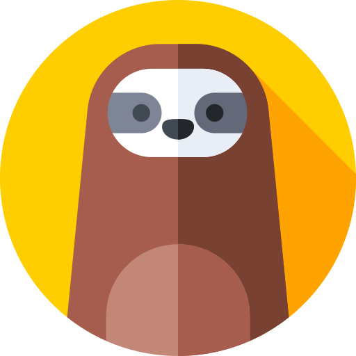

# GoToSocial

 

Federated social media software.

GoToSocial is a Fediverse server project, written in Golang. It provides an alternative to existing projects such as [Mastodon](https://joinmastodon.org/), [Pleroma](https://pleroma.social/), [Friendica](https://friendica.net), [PixelFed](https://pixelfed.org/) etc.

One of the key differences between GoToSocial and those other projects is that GoToSocial doesn't include an integrated front-end (ie., a webapp). Instead, like the Matrix.org's [Synapse](https://github.com/matrix-org/synapse) project, it provides only a server implementation and a well-documented API. On this API, developers are free to build any front-end implementation or mobile application that they wish.

Because the server implementation is as generic and flexible/configurable as possible, GoToSocial provides the basis for many different types of social media experience, whether Tumblr-like, Facebook-like, or Twitter-like.

## Goals

The first goal of the project is to implement a feature set comparable to Mastodon: server logic, federation logic, and a client API that's a superset of the Mastodon API described [here](https://docs.joinmastodon.org/).

Once the client API is implemented, it should allow existing Mastodon apps like [Tusky](https://tusky.app/) and [Whalebird](https://whalebird.social/en/desktop/contents) to work with GoToSocial.

After that, custom features will be added that will necessitate expanding the API.

## Wishlist

Among other things:

* Reputation-based 'slow' federation.
* Granular post settings.
* Local-only posting.
* Easily-configurable character limit.
* Groups and group posting.

## Implementation Status

For an up-to-date view on progress made towards a v1.0.0 release, see [here](./PROGRESS.md).

## Contact

For questions and comments, you can reach out to Tobi on the Fediverse [here](https://ondergrond.org/@dumpsterqueer) or mail admin@gotosocial.org.

## Sponsorship

Currently, this project is funded using Liberapay, to put bread on the table while Tobi works on it. If you want to sponsor this project and get your name on this repo, you can do so [here](https://liberapay.com/dumpsterqueer/)! `<3`

### Sponsors

None yet! [Go For It](https://liberapay.com/dumpsterqueer/)

### Image Attribution

Logo made by [Freepik](https://www.freepik.com) from [www.flaticon.com](https://www.flaticon.com/).
