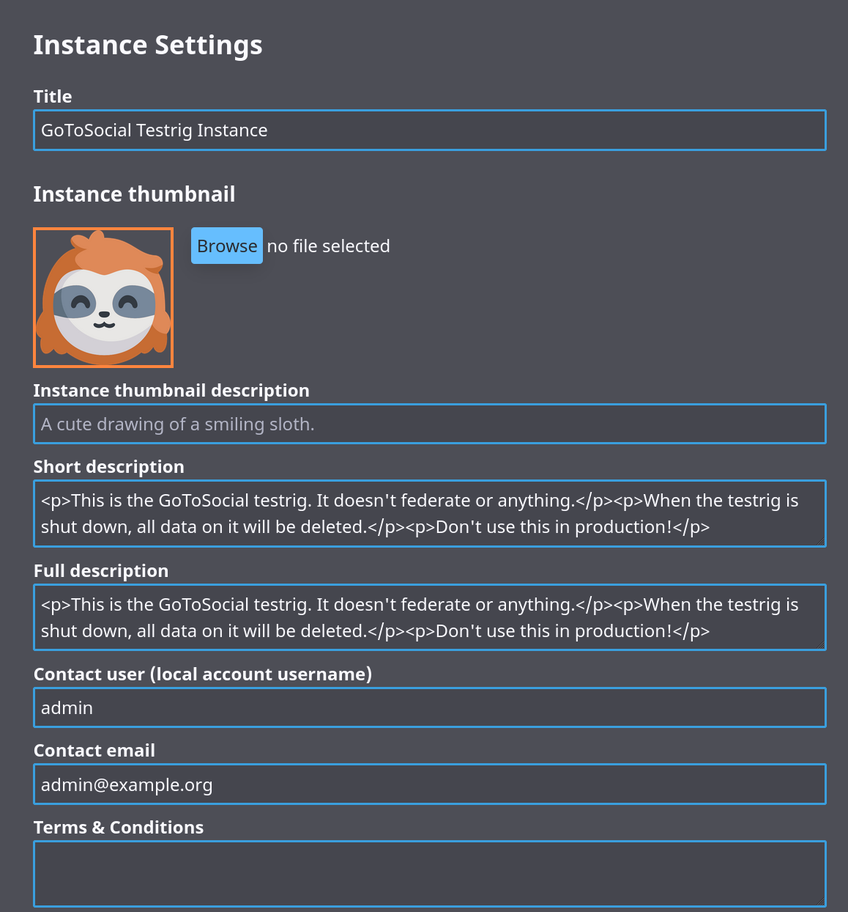
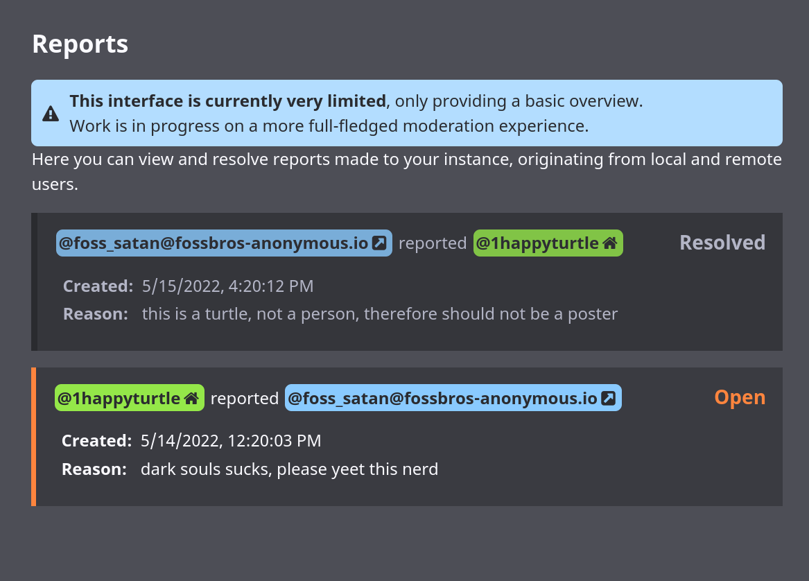
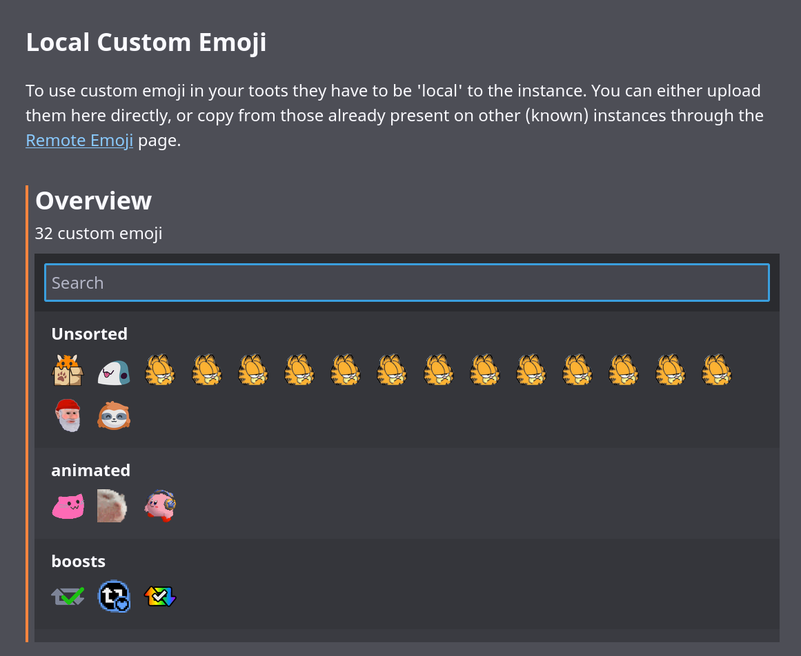

# Admin Settings

The GoToSocial Settings interface uses the [admin api routes](https://docs.gotosocial.org/en/latest/api/swagger/#operations-tag-admin) to manage your instance. It's combined with the [User settings](../user_guide/settings.md) and uses the same OAUTH mechanism as normal clients (with scope: admin).

## Account permissions
To use the Admin API your account has to be promoted as such:
```
./gotosocial --config-path ./config.yaml admin account promote --username YOUR_USERNAME
```

After this, you can enter your instance domain in the login field (auto-filled if you run GoToSocial on the same domain), and login like you would with any other client.


## Instance Settings


Here you can set various metadata for your instance, like the displayed name, thumbnail image, description texts (HTML), and contact username and email.

## Actions
You can use media cleanup to remove remote media older than the specified number of days. This also removes unused headers and avatars.

## Federation


In the federation section you can influence which instances you federate with, through adding domain blocks. You can enter a domain to suspend in the search field, which will filter the list to show you if you already have a block for it. Clicking 'suspend' gives you a form to add a public and/or private comment, and submit to add the block. Adding a suspension will suspend all the currently known accounts on the instance, and prevent any new interactions with any user on the blocked instance.

### Bulk import/export
Through the link at the bottom of the Federation section (or going to `/settings/admin/federation/import-export`) you can do bulk import/export of your domain blocklist. 


Upon importing a list, either through the input field or from a file, you can review the entries in the list before importing a subset. You'll also be warned for entries that use subdomains, providing an easy way to change them to the main domain.

## Reports


The reports section shows a list of reports, originating from your local users, or remote instances (shown anonymously as just the name of the instance, without specific username).

Clicking a report shows if it was resolved (with the reasoning if available), more information, and a list of reported toots if selected by the reporting user.

## Custom Emoji
Custom Emoji will be automatically fetched when included in remote toots, but to use them in your own posts they have to be enabled on your instance.

### Local


This section shows an overview of all the custom emoji enabled on your instance, sorted by their category. Clicking an emoji shows it's details, and provides options to change the category or image, or delete it completely. The shortcode cannot be updated here, you would have to upload it with the new shortcode yourself (and optionally delete the old one).

Below the overview you can upload your own custom emoji, after previewing how they look in a toot. PNG and (animated) GIF's are supported.

### Remote


Through the 'remote' section, you can look up a link to any remote toots (provided the instance isn't suspended). If they use any custom emoji they will be listed, providing an easy way to copy them to the local emoji (for use in your own toots), or disable them ( hiding them from toots).

**Note:** as the testrig server does not federate, this feature can't be used in development (500: Internal Server Error).

