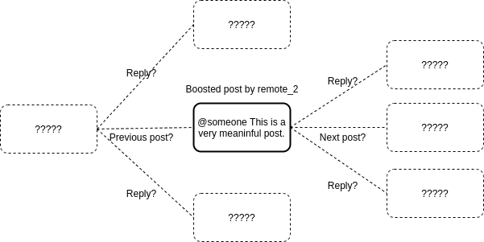

# Federating with GoToSocial
Information on the various (ActivityPub) elements needed to federate with GoToSocial.

## HTTP Signatures

GoToSocial requires all `GET` and `POST` requests to ActivityPub s2s endpoints to be accompanied by a valid http signature.

GoToSocial will also sign all outgoing `GET` and `POST` requests that it makes to other servers.

This behavior is the equivalent of Mastodon's [AUTHORIZED_FETCH / "secure mode"](https://docs.joinmastodon.org/admin/config/#authorized_fetch).

GoToSocial uses the [go-fed/httpsig](https://github.com/go-fed/httpsig) library for signing outgoing requests, and for parsing and validating the signatures of incoming requests. This library strictly follows the [Cavage http signature RFC](https://datatracker.ietf.org/doc/html/draft-cavage-http-signatures), which is the same RFC used by other implementations like Mastodon, Pixelfed, Akkoma/Pleroma, etc. (This RFC has since been superceded by the [httpbis http signature RFC](https://datatracker.ietf.org/doc/html/draft-ietf-httpbis-message-signatures), but this is not yet widely implemented.)

### Incoming Requests

GoToSocial request signature validation is implemented in [internal/federation](https://github.com/superseriousbusiness/gotosocial/blob/main/internal/federation/authenticate.go).

GoToSocial will attempt to parse the signature using the following algorithms (in order), stopping at the first success:

```text
RSA_SHA256
RSA_SHA512
ED25519
```

### Outgoing Requests

GoToSocial request signing is implemented in [internal/transport](https://github.com/superseriousbusiness/gotosocial/blob/main/internal/transport/signing.go).

When assembling signatures:

- outgoing `GET` requests use `(request-target) host date`
- outgoing `POST` requests use `(request-target) host date digest` 

GoToSocial uses the `RSA_SHA256` algorithm for signing requests, which is in line with other ActivityPub implementations.

### Quirks

The `keyId` used by GoToSocial in the `Signature` header will look something like the following:

```text
https://example.org/users/example_user/main-key
```

This is different from most other implementations, which usually use a fragment (`#`) in the `keyId` uri. For example, on Mastodon the user's key would instead be found at:

```text
https://example.org/users/example_user#main-key
```

For Mastodon, the public key of a user is served as part of that user's Actor representation. GoToSocial mimics this behavior when serving the public key of a user, but instead of returning the entire Actor at the `main-key` endpoint (which may contain sensitive fields), will return only a partial stub of the actor. This looks like the following:

```json
{
  "@context": [
    "https://w3id.org/security/v1",
    "https://www.w3.org/ns/activitystreams"
  ],
  "id": "https://example.org/users/example_user",
  "preferredUsername": "example_user",
  "publicKey": {
    "id": "https://example.org/users/example_user/main-key",
    "owner": "https://example.org/users/example_user",
    "publicKeyPem": "-----BEGIN PUBLIC KEY-----\nMIIBIjANBgkqhkiG9w0BAQEFAAOCAQ8AMIIBCgKCAQEAzGB3yDvMl+8p+ViutVRG\nVDl9FO7ZURYXnwB3TedSfG13jyskoiMDNvsbLoUQM9ajZPB0zxJPZUlB/W3BWHRC\nNFQglE5DkB30GjTClNZoOrx64vLRT5wAEwIOjklKVNk9GJi1hFFxrgj931WtxyML\nBvo+TdEblBcoru6MKAov8IU4JjQj5KUmjnW12Rox8dj/rfGtdaH8uJ14vLgvlrAb\neQbN5Ghaxh9DGTo1337O9a9qOsir8YQqazl8ahzS2gvYleV+ou09RDhS75q9hdF2\nLI+1IvFEQ2ZO2tLk3umUP1ioa+5CWKsWD0GAXbQu9uunAV0VoExP4+/9WYOuP0ei\nKwIDAQAB\n-----END PUBLIC KEY-----\n"
  },
  "type": "Person"
}
```

Remote servers federating with GoToSocial should extract the public key from the `publicKey` field. Then, they should use the `owner` field of the public key to further dereference the full version of the Actor, using a signed `GET` request.

This behavior was introduced as a way of avoiding having remote servers make unsigned `GET` requests to the full Actor endpoint. However, this may change in future as it is not compliant and causes issues. Tracked in [this issue](https://github.com/superseriousbusiness/gotosocial/issues/1186).


## Access Control

GoToSocial uses access control restrictions to protect users and resources from unwanted interactions with remote accounts and instances.

As shown in the [HTTP Signatures](#http_signatures.md) section, GoToSocial requires all incoming `GET` and `POST` requests from remote servers to be signed. Unsigned requests will be denied with http code `401 Unauthorized`.

Access control restrictions are implemented by checking the `keyId` of the signature (who owns the public/private key pair making the request).

First, the host value of the `keyId` uri is checked against the GoToSocial instance's list of blocked (defederated) domains. If the host is recognized as a blocked domain, then the http request will immediately be aborted with http code `403 Forbidden`.

Next, GoToSocial will check for the existence of a block (in either direction) between the owner of the public key making the http request, and the owner of the resource that the request is targeting. If the GoToSocial user blocks the remote account making the request, then the request will be aborted with http code `403 Forbidden`.

## Request Throttling & Rate Limiting
GoToSocial applies http request throttling and rate limiting to the ActivityPub API endpoints (inboxes, user endpoints, emojis, etc).

This ensures that remote servers cannot flood a GoToSocial instance with spurious requests. Instead, remote servers making GET or POST requests to the ActivityPub API endpoints should respect 429 and 503 http codes, and take account of the `retry-after` http response header.

For more details on request throttling and rate limiting behavior, please see the [throttling](../api/throttling.md) and [rate limiting](../api/ratelimiting.md) documents.

## Outbox

GoToSocial implements Outboxes for Actors (ie., instance accounts) following the ActivityPub specification [here](https://www.w3.org/TR/activitypub/#outbox).

To get an [OrderedCollection](https://www.w3.org/TR/activitystreams-vocabulary/#dfn-orderedcollection) of Activities that an Actor has published recently, remote servers can do a `GET` request to a user's outbox. The address of this will be something like `https://example.org/users/whatever/outbox`.

The server will return an OrderedCollection of the following structure:

```json
{
    "@context": "https://www.w3.org/ns/activitystreams",
    "id": "https://example.org/users/whatever/outbox",
    "type": "OrderedCollection",
    "first": "https://example.org/users/whatever/outbox?page=true"
}
```

Note that the `OrderedCollection` itself contains no items. Callers must dereference the `first` page to start getting items. For example, a `GET` to `https://example.org/users/whatever/outbox?page=true` will produce something like the following:

```json
{
    "id": "https://example.org/users/whatever/outbox?page=true",
    "type": "OrderedCollectionPage",
    "next": "https://example.org/users/whatever/outbox?max_id=01FJC1Q0E3SSQR59TD2M1KP4V8&page=true",
    "prev": "https://example.org/users/whatever/outbox?min_id=01FJC1Q0E3SSQR59TD2M1KP4V8&page=true",
    "partOf": "https://example.org/users/whatever/outbox",
    "orderedItems": [
        {
            "id": "https://example.org/users/whatever/statuses/01FJC1MKPVX2VMWP2ST93Q90K7/activity",
            "type": "Create",
            "actor": "https://example.org/users/whatever",
            "published": "2021-10-18T20:06:18Z",
            "to": [
                "https://www.w3.org/ns/activitystreams#Public"
            ],
            "cc": [
                "https://example.org/users/whatever/followers"
            ],
            "object": "https://example.org/users/whatever/statuses/01FJC1MKPVX2VMWP2ST93Q90K7"
        }
    ]
}
```

The `orderedItems` array will contain up to 30 entries. To get more entries beyond that, the caller can use the `next` link provided in the response.

Note that in the returned `orderedItems`, all activity types will be `Create`. On each activity, the `object` field will be the AP URI of an original public status created by the Actor who owns the Outbox (ie., a `Note` with `https://www.w3.org/ns/activitystreams#Public` in the `to` field, which is not a reply to another status). Callers can use the returned AP URIs to dereference the content of the notes.

## Conversation Threads
Due to the nature of decentralization and federation, it is practically impossible for any one server on the fediverse to be aware of every post in a given conversation thread.

With that said, it is possible to do 'best effort' dereferencing of threads, whereby remote replies are fetched from one server onto another, to try to more fully flesh out a conversation.

GoToSocial does this by iterating up and down the thread of a conversation, pulling in remote statuses where possible.

Let's say we have two accounts: `local_account` on `our.server`, and `remote_1` on `remote.1`.

In this scenario, `local_account` follows `remote_1`, so posts from `remote_1` show up in the home timeline of `local_account`.

Now, `remote_1` boosts/reblogs a post from a third account, `remote_2`, residing on server `remote.2`.

`local_account` does not follow `remote_2`, and neither does anybody else on `our.server`, which means that `our.server` has not seen this post by `remote_2` before.



What GoToSocial will do now, is 'dereference' the post by `remote_2` to check if it is part of a thread and, if so, whether any other parts of the thread can be obtained.

GtS begins by checking the `inReplyTo` property of the post, which is set when a post is a reply to another post. [See here](https://www.w3.org/TR/activitystreams-vocabulary/#dfn-inreplyto). If `inReplyTo` is set, GoToSocial derefences the replied-to post. If *this* post also has an `inReplyTo` set, then GoToSocial dereferences that too, and so on.

Once all of these **ancestors** of a status have been retrieved, GtS will begin working down through the **descendants** of posts.

It does this by checking the `replies` property of a derefenced post, and working through replies, and replies of replies. [See here](https://www.w3.org/TR/activitystreams-vocabulary/#dfn-replies).

This process of thread dereferencing will likely involve making multiple HTTP calls to different servers, especially if the thread is long and complicated.

The end result of this dereferencing is that, assuming the reblogged post by `remote_2` was part of a thread, then `local_account` should now be able to see posts in the thread when they open the status on their home timeline. In other words, they will see replies from accounts on other servers (who they may not have come across yet), in addition to any previous and next posts in the thread as posted by `remote_2`.

This gives `local_account` a more complete view on the conversation, as opposed to just seeing the reblogged post in isolation and out of context. It also gives `local_account` the opportunity to discover new accounts to follow, based on replies to `remote_2`.

## Reports / Flags

Like other microblogging ActivityPub implementations, GoToSocial uses the [Flag](https://www.w3.org/TR/activitystreams-vocabulary/#dfn-flag) Activity type to communicate user moderation reports to other servers.

### Outgoing

The json of an outgoing GoToSocial `Flag` looks like the following:

```json
{
  "@context": "https://www.w3.org/ns/activitystreams",
  "actor": "http://example.org/users/example.org",
  "content": "dark souls sucks, please yeet this nerd",
  "id": "http://example.org/reports/01GP3AWY4CRDVRNZKW0TEAMB5R",
  "object": [
    "http://fossbros-anonymous.io/users/foss_satan",
    "http://fossbros-anonymous.io/users/foss_satan/statuses/01FVW7JHQFSFK166WWKR8CBA6M"
  ],
  "type": "Flag"
}
```

The `actor` of the `Flag` will always be the instance actor of the GoToSocial instance on which the `Flag` was created. This is done to preserve partial anonymity of the user who created the report, in order to prevent them becoming a target for harassment.

The `content` of the `Flag` is a piece of text submitted by the user who created the `Flag`, which should give remote instance admins a reason why the report was created. This may be an empty string, or may not be present on the json, if no reason was submitted by the user.

The value of the `object` field of the `Flag` will either be a string (the ActivityPub `id` of the user being reported), or it will be an array of strings, where the first entry in the array is the `id` of the reported user, and subsequent entries are the `id`s of one or more reported `Note`s / statuses.

The `Flag` activity is delivered as-is to the `inbox` (or shared inbox) of the reported user. It is not wrapped in a `Create` activity.

### Incoming

GoToSocial assumes incoming reports will be delivered as a `Flag` Activity to the `inbox` of the account being reported.  It will parse the incoming `Flag` following the same formula that it uses for creating outgoing `Flag`s, with one difference: it will attempt to parse status URLs from both the `object` field, and from a Misskey/Calckey-formatted `content` value, which includes in-line status URLs.

GoToSocial will not assume that the `to` field will be set on an incoming `Flag` activity. Instead, it assumes that remote instances use `bto` to direct the `Flag` to its recipient.

A valid incoming `Flag` Activity will be made available as a report to the admin(s) of the GoToSocial instance that received the report, so that they can take any necessary moderation action against the reported user.

The reported user themself will not see the report, or be notified that they have been reported, unless the GtS admin chooses to share this information with them via some other channel. 
