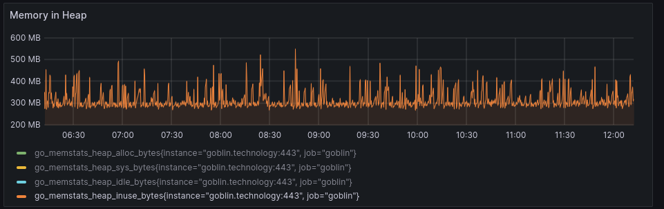

# Deployment considerations

Before deploying GoToSocial, it's important to think through a few things as some choices will have long-term consequences for how you run and manage GoToSocial.

!!! danger

    It's not supported across the Fediverse to switch between implementations on the same domain. This means that if you run GoToSocial on example.org, you'll run into federation issues if you try to switch to a different implementation like Pleroma/Akkoma, Misskey/Calckey etc.
    
    In that same vein, if you already have another ActivityPub implementation running on example.org you should not attempt to switch to GoToSocial on that domain.

## Server / VPS System Requirements

GoToSocial aims to fit in small spaces so we try and ensure that the system requirements are reasonably minimal, while still providing the functionality that people expect of a social media server.

You can find more detail on system requirements below, but in short you should aim to have a system with at least **1 CPU core**, about **1GB of memory** (maybe more depending on your operating system), and **15GB-20GB of storage space** (for the first few years).

### Memory

**Tl;dr -- 1GB of total RAM on your system should be enough, but you may be able to get away with 512MB.**

For a small instance (1-20 active users), GoToSocial will likely hover consistently between 250MB and 350MB of RAM usage once the internal caches are hydrated:

In the graph above you can see that RAM usage spikes during periods of load. This happens, for example, when when a status gets boosted by someone with many followers, or when the embedded `ffmpeg` binary is decoding or reencoding media files into thumbnails (especially larger video files).

You should account for some overhead in this case, and if necessary [configure some swap memory](#swap).

!!! tip
    In memory constrained environments, you can also try setting `cache.memory-target` to a value lower than the default 100MB (see the database configuration options [here](../configuration/database.md#settings)). 50MB has been shown to work fine.

    This should make the overall memory use a little lower once the internal caches are hydrated, but at the cost of slightly higher latency on some requests, as GtS will need to call the database more frequently.

!!! info "Why does `htop` show higher memory usage than in the graph?"
    You may find that if you run `top` or `htop` or some other system resource readout tool on your server, GoToSocial shows higher reserved memory than in the graph above. However, this does not always reflect actual *in-use* memory by GoToSocial. This disparity is caused by the fact that the Go runtime releases memory back to the operating system somewhat conservatively, since it is often cheaper to hold on to idle memory in order to reuse it, than it is to immediately release it back to the OS and have to ask for it back later on.

### CPU

**Tl;dr -- 1 decent CPU core should be fine.**

CPU usage is only intensive when handling media (encoding blurhashes, mostly) and/or handling a lot of federation requests at the same time. As long as you're not running CPU intensive stuff on the same machine, 1 CPU core will do the job.

### Storage

**Tl;dr -- 15GB-20GB of available storage space should be fine for a few years.**

GoToSocial uses storage for its database files, and for storing + serving media files like avatars, attachments, etc., though you can [configure GtS to use an S3 bucket for media instead](../configuration/storage.md) if you prefer.

After about 3 years of use for a single-user instance, following ~300 people, you can expect your sqlite.db file or Postgres database volume to get up to around 10GB or so.

For media storage, including [storage of remote media files in the cache](../admin/media_caching.md), you should budget about 5GB-10GB of space. GoToSocial automatically cleans up after itself by removing unused remote media from the cache after a while. If storage space an issue, you can [tune this media cleanup behavior](../admin/media_caching.md#cleanup) to clean more regularly and/or to keep remote media cached for less time.

!!! info
    Don't be alarmed if your sqlite.db file or your Postgres volume grows very quickly at first, this is normal. When you first deploy your instance and start federating, your instance discovers and stores accounts and statuses from other instances rapidly. However, this will gradually slow down the longer your instance is deployed, as you naturally start to see fewer "new" accounts (ie., accounts that your instance hasn't seen yet, and therefore hasn't yet stored in the database).

### Single-board Computers

GoToSocial's light system requirements means that it runs pretty well on decently-specced single-board computers. If running on a single-board computer, you should ensure that GoToSocial is using a USB drive (preferably an SSD) to store its database files and media, not SD card storage, since the latter tends to be too slow to run a database on.

### VPS

If you decide to use a VPS instead, you can spin yourself up something cheap with Linux running on it. Most of the VPS offerings in the €2-€5 per month range will perform admirably for a personal GoToSocial instance.

[Hostwinds](https://www.hostwinds.com/) is a good option here: it's cheap and they throw in a static IP address for free.

[Greenhost](https://greenhost.net) is also great: it has zero CO2 emissions, but is a bit more costly. Their 1GB, 1-cpu VPS works great for a single-user or small instance.

!!! danger "Oracle Free Tier"
    [Oracle Cloud Free Tier](https://www.oracle.com/cloud/free/) servers are not suitable for a GoToSocial deployment if you intend to federate with more than a handful of other instances and users.
    
    GoToSocial admins running on Oracle Cloud Free Tier have reported that their instances become extremely slow or unresponsive during periods of moderate load. This is most likely due to memory or storage latency, which causes even simple database queries to take a long time to run.

!!! danger "Hetzner Cloud Volume"
    The [performance of Hetzner Cloud Volumes](https://github.com/superseriousbusiness/gotosocial/issues/2471#issuecomment-1891098323) is not guaranteed and seems to have very volatile latency. You're going to have a bad time running your database on those, with extremely poor query performance for even the most basic operations. Before filing performance issues against GoToSocial, make sure the problems reproduce with local storage.

### Distribution system requirements

Please make sure to check on your distribution system requirments, especially memory. Many distributions have baseline requirements and running them on a system that doesn't meet them will cause problems without further tuning and tweaking on your part.

Linux:

* [Arch Linux][archreq]: `512MB` RAM
* [Debian][debreq]: `786MB` RAM
* [Ubuntu][ubireq]: `1GB` RAM
* [RHEL 8+][rhelreq] and derivatives: `1.5GB` RAM
* [Fedora][fedorareq]: `2GB` RAM

The BSD family of distributions don't document memory requirements as much, but anywhere up from `128MB` is expected to be sufficient.

[archreq]: https://wiki.archlinux.org/title/installation_guide
[debreq]: https://www.debian.org/releases/stable/amd64/ch02s05.en.html
[ubireq]: https://ubuntu.com/server/docs/installation
[rhelreq]: https://access.redhat.com/articles/rhel-limits#minimum-required-memory-3
[fedorareq]: https://docs.fedoraproject.org/en-US/fedora/latest/release-notes/welcome/Hardware_Overview/#hardware_overview-specs

## Database

GoToSocial supports both SQLite and Postgres as database drivers. Though it is possible in theory to swap your database from SQLite to Postgres or vice versa, we do not currently have tooling to support this, so you should consider your choice of database carefully when starting out.

SQLite is the default driver and it's been shown to work brilliantly for instances in the range of 1-30 users (or maybe more).

If you're planning on hosting more people than this on an instance, you may wish to use Postgres instead, as it offers the possibility of database clustering and redundancy, at the cost of some complexity.

Regardless of which database driver you choose, for proper performance they should be run on fast storage that operates with low and stable latency. It is possible to run databases on network attached storage, but this adds variable latency and network congestion to the mix, as well as potential I/O contention on the origin storage.

!!! danger "Cloud Storage Volumes"
    Not all cloud VPS storage offerings are equal, and just because something claims to be backed by an SSD doesn't mean that it will necessarily be suitable to run a GoToSocial instance on. Please see the [Server/VPS section](#vps) section below.

!!! tip
    Please [backup your database](../admin/backup_and_restore.md). The database contains encryption keys for the instance and any user accounts. You won't be able to federate again from the same domain if you lose these keys!

## Domain name

In order to federate with others, you'll need a domain like `example.org`. You can register your domain name through any domain registrar, like [Namecheap](https://www.namecheap.com/). Make sure you pick a registrar that also lets you manage DNS entries, so you can point your domain to the IP of the server that's running your GoToSocial instance.

You'll commonly see usernames existing at the apex of the domain, for example `@me@example.org` but this is not required. It's perfectly fine to have users exist on `@me@social.example.org` instead. Many people prefer to have usernames on the apex as its shorter to type, but you can use any (subdomain) you control.

It is possible to have usernames like `@me@example.org` but have GoToSocial running on `social.example.org` instead. This is done by distinguishing between the API domain, called the "host", and the domain used for usernames, called the "account domain".

If you intend to deploy your GoToSocial instance in this way, please read the [Split-domain deployments](../advanced/host-account-domain.md) document for details on how to do this.

!!! danger
    It's not possible to safely change whether the host and account domain are different after the fact. It requires regenerating the database and will cause confusion for any server you have already federated with. Once your instance host and account domain are set, they're set.

## TLS

For federation to work, you have to use TLS. Most implementations, including GoToSocial, will generally refuse to federate over unencrypted transports.

GoToSocial comes with built-in support for provisioning certificates through Lets Encrypt. It can also load certificates from disk. If you have a reverse-proxy in front of GoToSocial you can handle TLS at that level instead.

!!! tip
    Make sure you configure the use of modern versions of TLS, TLSv1.2 and higher, in order to keep communications between servers and clients safe. When GoToSocial handles TLS termination this is done automatically for you. If you have a reverse-proxy in use, use the [Mozilla SSL Configuration Generator](https://ssl-config.mozilla.org/).

## Ports

GoToSocial needs ports `80` and `443` open.

* `80` is used for Lets Encrypt. As such, you don't need it if you don't use the built-in Lets Encrypt provisioning.
* `443` is used to serve the API on with TLS and is what any instance you're federating with will try to connect to.

If you can't leave `443` and `80` open on the machine, don't worry! You can configure these ports in GoToSocial, but you'll have to also configure port forwarding to properly forward traffic on `443` and `80` to whatever ports you choose.

!!! tip
    You should configure a firewall on your machine, as well as some protection against brute-force SSH login attempts and the like. Take a look at our [firewall documentation](../advanced/security/firewall.md) for pointers on what to configure and tools that can help you out.

## Clustering / multi-node deployments

GoToSocial does not support [clustering or any form of multi-node deployment](https://github.com/superseriousbusiness/gotosocial/issues/1749).

Though multiple GtS instances can use the same Postgres database and either shared local storage or the same object bucket, GtS relies on a lot of internal caching to keep things fast. There is no mechanism for synchronising these caches between instances. Without it, you'll get all kinds of odd and inconsistent behaviour. Don't do this!

## Tuning

Aside from the many instance tuning options present in the [example config file](https://github.com/superseriousbusiness/gotosocial/blob/main/example/config.yaml) you can do additional tuning on the machine your GoToSocial instance is running on.

### Swap

Unless you're experienced in doing this kind of tuning and troubleshooting the issues that may arise from not having swap, you should follow your distribution or hosting provider's recommendations and configure an appropriate amount of swap. If your distribution or hosting provider doesn't provide guidance, you can use the following rule of thumb for a server:

* less than 2GB of RAM: swap = RAM × 2
* more than 2GB of RAM: swap = RAM, up to 8G

!!! tip "Configuring Swappiness"
    Linux swaps pretty early. This tends to not be necessary on servers and in the case of databases can cause unnecessary latency. Though it's good to let your system swap if it needs to, it can help to tell it to be a little more conservative about how early it swaps. Configuring this on Linux is done by changing the `vm.swappiness` [sysctl][sysctl] value.
    
    By default it's `60`. You can lower that to `10` for starters and keep an eye out. It's possible to run with even lower values, but it's likely unnecessary. To make the value persistent, you'll need to drop a configuration file in `/etc/sysctl.d/`.

While it is possible to run a system without swap, in order to safely do so and ensure consistent performance and service availability, you need to tune the kernel, system and your workloads accordingly. This requires a good understanding of your kernel's memory management system as well as the memory usage patterns of the workloads you're running.

!!! note
    Swap is used to ensure the kernel can efficiently reclaim memory. This is useful even when a system is not experiencing memory contention, like freeing up memory that was only used during process startup. This allows more things that are actively used to be cached in memory. Swap is not what makes your application slow. Experiencing memory contention is what makes things slow.

[sysctl]: https://man7.org/linux/man-pages/man8/sysctl.8.html

### Memory and CPU limits

It is possible to limit the amount of memory or CPU your GoToSocial instance can consume. Doing so can be done on Linux using [CGroups v2 resource controllers][cgv2].

You can configure limits for a process using [systemd resource control settings][systemdcgv2], [OpenRC cgroup support][openrccgv2] or the [libcgroup CLI][libcg]. If you want to protect GoToSocial in cases where your system is experiencing memory pressure, look at [`memory.low`][cgv2mem].

[cgv2]: https://www.kernel.org/doc/html/latest/admin-guide/cgroup-v2.html
[systemdcgv2]: https://www.freedesktop.org/software/systemd/man/latest/systemd.resource-control.html
[openrccgv2]: https://wiki.gentoo.org/wiki/OpenRC/CGroups
[libcg]: https://github.com/libcgroup/libcgroup/
[cgv2mem]: https://docs.kernel.org/admin-guide/cgroup-v2.html#memory-interface-files
