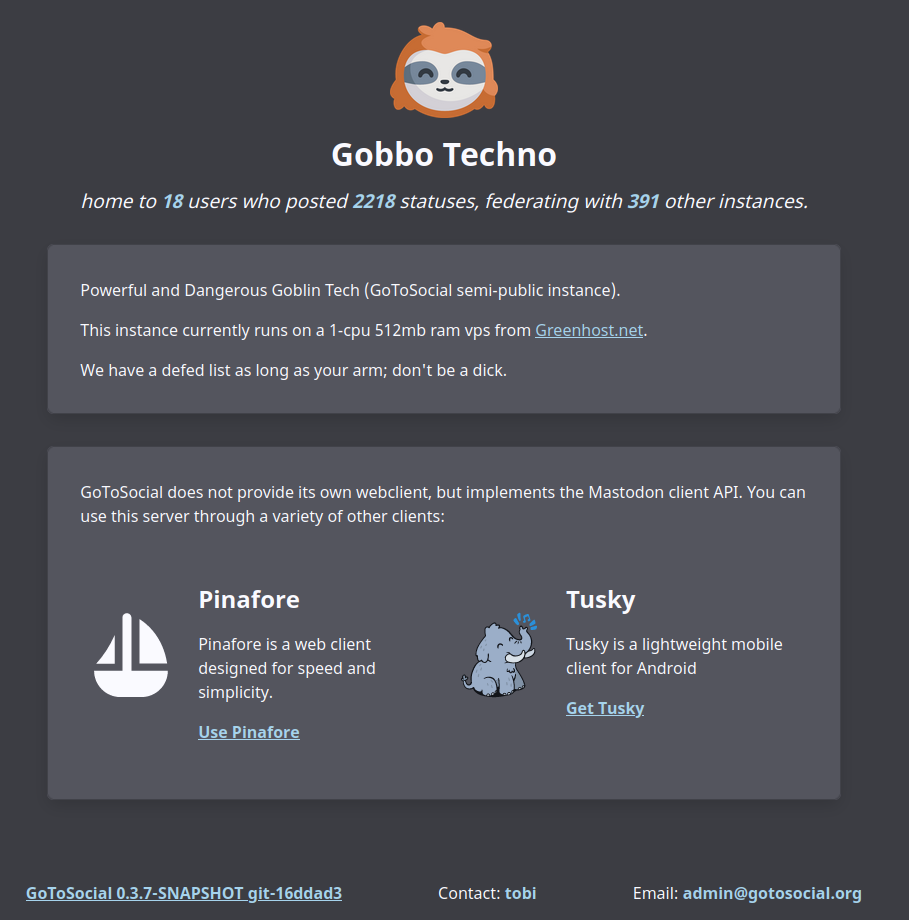
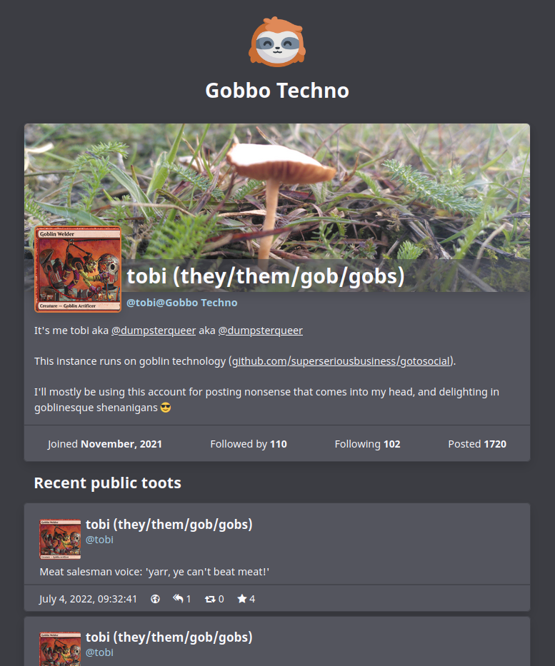

# What is GoToSocial?

GoToSocial is an [ActivityPub](https://activitypub.rocks/) social network server, written in Golang.

With GoToSocial, you can keep in touch with your friends, post, read, and share images and articles. All without being tracked or advertised to!

  

GoToSocial provides a lightweight, customizable, and safety-focused entryway into the [Fediverse](https://en.wikipedia.org/wiki/Fediverse), and is comparable to (but distinct from) existing projects such as [Mastodon](https://joinmastodon.org/), [Pleroma](https://pleroma.social/), [Friendica](https://friendica.net), and [PixelFed](https://pixelfed.org/).

**GoToSocial is still [ALPHA SOFTWARE](https://en.wikipedia.org/wiki/Software_release_life_cycle#Alpha)**. It is already deployable and useable, and it federates cleanly with many other Fediverse servers (not yet all). However, many things are not yet implemented, and there are plenty of bugs! We foresee entering beta somewhere in 2023.

Here's a screenshot of the instance landing page!

If you've ever used something like Twitter or Tumblr (or even Myspace!) GoToSocial will probably feel familiar to you: You can follow people and have followers, you make posts which people can favourite and reply to and share, and you scroll through posts from people you follow using a timeline. You can write long posts or short posts, or just post images, it's up to you. You can also, of course, block people or otherwise limit interactions that you don't want by posting just to your friends.

**GoToSocial does NOT use algorithms or collect data about you to suggest content or 'improve your experience'**. The timeline is chronological: whatever you see at the top of your timeline is there because it's *just been posted*, not because it's been selected as interesting (or controversial) based on your personal profile.

GoToSocial is not designed for 'must-follow' influencers with tens of thousands of followers, and it's not designed to be addictive. Your timeline and your experience is shaped by who you follow and how you interact with people, not by metrics of engagement!

GoToSocial doesn't claim to be *better* than any other application, but it offers something that might better *for you* in particular.

## History and Status

This project sprang up in 2021 out of a dissatisfaction with the safety + privacy features of other Federated microblogging/social media applications, and a desire to implement something a little different.

It began as a solo project, and then picked up steam as more developers became interested and jumped on.

## Known Issues

Since GoToSocial is still in alpha, there are plenty of bugs. We use Github issues to track these. [Check them out here](https://github.com/superseriousbusiness/gotosocial/issues?q=is%3Aissue+is%3Aopen+label%3Abug).

### Client App Issues

GoToSocial works great with Tusky and Pinafore, but some other client applications still need work or have issues connecting to GoToSocial. We're tracking them [right here](https://github.com/superseriousbusiness/gotosocial/projects/5). It's our goal to make any app that's compatible with the Mastodon API work seamlessly with GoToSocial.

### Federation Issues

Since every ActivityPub server implementation has a slightly different interpretation of the protocol, some servers don't quite federate properly with GoToSocial yet. We're tracking these issues [in this project](https://github.com/superseriousbusiness/gotosocial/projects/4). Eventually we want to make sure that any implementation that can federate nicely with Mastodon should also be able to federate with GoToSocial.

## Contributing

You wanna contribute to GtS? Great! ❤️❤️❤️ Check out the issues page to see if there's anything you wanna jump in on, and read the CONTRIBUTING.md file on the repository for guidelines and setting up your dev environment.

## Contact

For questions and comments, you can [join our Matrix channel](https://matrix.to/#/#gotosocial:superseriousbusiness.org) at `#gotosocial:superseriousbusiness.org`. This is the quickest way to reach the devs. You can also mail [admin@gotosocial.org](mailto:admin@gotosocial.org).

For bugs and feature requests, please check to see if there's [already an issue](https://github.com/superseriousbusiness/gotosocial/issues), and if not, open one or use one of the above channels to make a request (if you don't have a Github account).

## Credits

### Image Attribution

Sloth logo by [Anna Abramek](https://abramek.art/), Copyright (C) 2021-2022 the GoToSocial Authors.

### Developers

In alphabetical order:

- f0x \[[donate with liberapay](https://liberapay.com/f0x)\]
- kim
- tobi \[[donate with liberapay](https://liberapay.com/GoToSocial/)\]

### Special Thanks

A huge thank you to CJ from [go-fed](https://github.com/go-fed/activity): without your work GoToSocial would not have been possible.

Thanks to everyone who has used GtS, opened an issue, suggested something, given funding, and otherwise encouraged or supported the project!

## Sponsorship + Funding

### OpenCollective

   

Currently, work on GoToSocial is funded through donations to our [OpenCollective](https://opencollective.com/) page.

If you would like to donate to GoToSocial to keep the lights on during development, [you can do so here](https://opencollective.com/gotosocial)! 💕 🦥 💕 Thank you!

### LiberaPay

 

If you prefer, we also have an account on LiberaPay! You can find that [right here](https://liberapay.com/GoToSocial/).

### Provisos

**Please note: GoToSocial has NO CORPORATE SPONSORS and does not desire corporate sponsorship. In addition, we do not take donations from any of the following: adult websites, affiliate and review websites, casinos and gambling, insurance and financial products (credit), pharmacy products, SEO services and social media buying, VPN and proxy services, and essay writing services. Donations from such sources will be automatically rejected.**

## License

GoToSocial is free software, licensed under the GNU AGPL v3 LICENSE. We encourage forking and changing the code, hacking around with it, and experimenting.

See [here](https://www.gnu.org/licenses/why-affero-gpl.html) for the differences between AGPL versus GPL licensing, and [here](https://www.gnu.org/licenses/gpl-faq.html) for FAQ's about GPL licenses, including the AGPL.

If you modify the GoToSocial source code, and run that modified code in a way that's accessible over a network, you *must* make your modifications to the source code available following the guidelines of the license:

> \[I\]f you modify the Program, your modified version must prominently offer all users interacting with it remotely through a computer network (if your version supports such interaction) an opportunity to receive the Corresponding Source of your version by providing access to the Corresponding Source from a network server at no charge, through some standard or customary means of facilitating copying of software.
