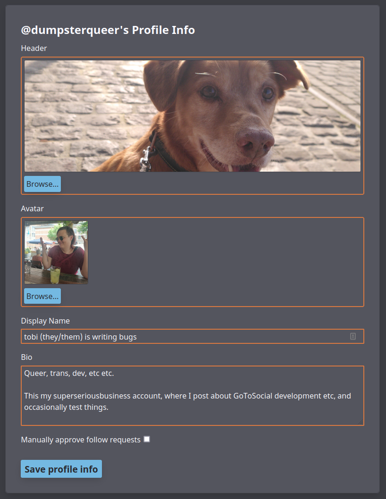
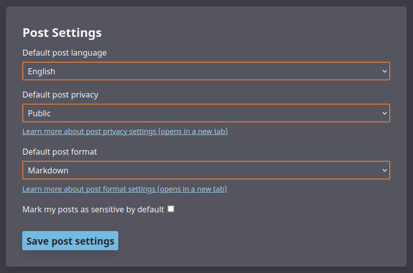

# Settings

GoToSocial provides a settings interface where you can update your post settings, add an avatar and header image, write a bio for your account, and so on.

You can access the Settings at `https://my-instance.example.com/settings` with your own GoToSocial instance. It uses the same OAUTH mechanism as normal clients (with scope: admin), and as such can be accessed from anywhere, separately from your own instance, or ran locally. A public installation is available here: [https://gts.superseriousbusiness.org/settings](https://gts.superseriousbusiness.org).

You will be prompted to log in with your email address and password after providing the instance url (auto-filled when using the page that comes with your instance).

## Profile

In the profile section you can change your display name, avatar and header images. You can also choose to enable manually approving follow requests, and opt-in to providing a public RSS feed of your posts.

### Set Avatar / Header

To set an avatar or header image, click on the `Browse` button in the appropriate section, and use the file browser to select an image.

Currently, supported image formats are `gif`, `png`, and `jpeg`/`jpg`.

A preview of the image as it will appear on your profile will be shown. If you're happy with your choices, click on the `Save profile info` button at the bottom of the Profile Info section. If you navigate to your profile and refresh the page, your new avatar / header will be shown. It might take a bit longer for the update to federate out to remote instances.

### Set Displayname and Bio

Your display name is a short handle shown alongside your username on your profile. While your username cannot be changed once it's created, your display name can. Your display name can also contain spaces, capital letters, emojis, and so on. It's a great place to put a nickname, full name, and/or pronouns. For example, if your username is `@miranda`, your display name could be something like `Miranda Priestly (she/her)`.

Your bio is a longer text that introduces your account and your self. Your bio is a good place to:

- Give an indication of the sort of things you post about
- Mention your approximate age / location
- Link to any of your other accounts or profiles elsewhere
- Describe your boundaries and preferences when it comes to other people interacting with you
- Link hashtags that you often use when you post

The bio accepts either `plain` or `markdown` formatting. This is set by the default post format setting described in [User Settings](#user-settings).

After updating your display name and bio, click on the `Save profile info` button at the bottom of the Profile Info section to save your changes.

### Manually Approve Followe Requests / Lock Your Account

At the bottom of the Profile Info section, there's a checkbox to manually approve follow requests.

When this is **not checked**, new follow requests are approved automatically without your intervention. This is useful for more public-facing accounts or cases where you don't really post anything sensitive or private.

When it is **checked**, you must manually approve new follow requests, and you can deny follow requests from accounts you don't want to follow you. This is useful for private accounts where you post personal things to followers only.

This option is often referred to on the fediverse as "locking" your account.

After ticking or unticking the checkbox, be sure to click on the `Save profile info` button at the bottom to save your new settings.

### Enable RSS feed of Public posts

RSS feeds for users are disabled by default, but can be opted into with this checkbox. For more information see [RSS](./rss.md). It's important to note that this by-passes follow requests, allowing anyone to get updates on your public posts. This feed only includes posts set as 'Public' (see [Privacy Settings](./posts.md#privacy-settings)). 

### Custom CSS
If enabled on your instance, [Custom CSS](./custom_css.md) allows you to theme the way your profile looks when visited through a browser. When this setting is not enabled, the field is hidden.

## Settings

In the 'Settings' section, you can set various defaults for new posts.

The default post language setting allows you to indicate to other fediverse users which language your posts are usually written in. This is helpful for fediverse users who speak (for example) Korean, and would prefer to filter out posts written in other languages.

The default post privacy setting allows you to set the default privacy for new posts. This is useful when you generally prefer to post public or followers-only, but you don't want to have to remember to set the privacy every time you post. Remember, this is only the default: no matter what you set here, you can still set the privacy individually for new posts if desired. For more information on post privacy settings, see the [page on Posts](./posts.md).

The default post format setting allows you to set which text interpreter should be used when parsing your posts.

The plain (default) setting provides standard post formatting, similar to what many other fediverse servers use. This is great for general purpose posting: you can write short, twitter-style posts, or multi-paragraph essays, insert links, and mention other accounts using their username.

The markdown setting indicates that your posts should be parsed as Markdown, which is a markup language that gives you more options for customizing the layout and appearance of your posts. For more information on the differences between plain and markdown post formats, see the [posts page](posts.md).

When you are finished updating your post settings, remember to click the `Save post settings` button at the bottom of the section to save your changes.

## Password Change

You can use the Password Change section of the User Settings Panel to set a new password for your account.

For more information on the way GoToSocial manages passwords, please see the [Password management document](./password_management.md).

## Admins

If your account has been promoted to admin, this interface will also show sections related to admin actions, see [Admin Settings](../admin/settings.md).