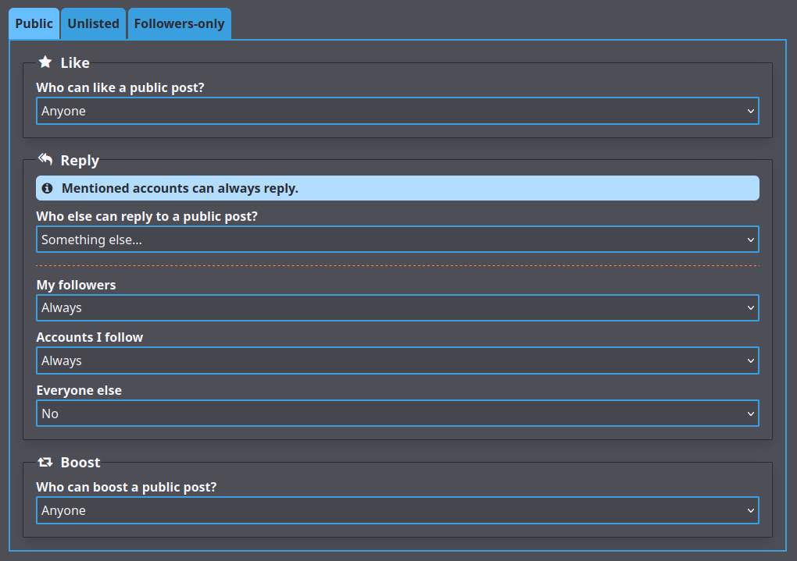

# Settings

GoToSocial provides a settings interface where you can update your post and profile settings, add an avatar and header image, write a bio for your account, and so on.

You can access the Settings at `https://my-instance.example.com/settings` with your own GoToSocial instance. It uses the same OAuth mechanism as normal clients.

You will be prompted to log in with your email address and password after providing the instance url.

## Profile

In the profile section you can change your display name, avatar and header images. You can also choose to enable manually approving follow requests, and opt-in to providing a public RSS feed of your posts.

### Set Avatar / Header

To set an avatar or header image, click on the `Browse` button in the appropriate section, and use the file browser to select an image.

Currently, supported image formats are `gif`, `png`, `webp`, and `jpeg`/`jpg`.

A preview of the image as it will appear on your profile will be shown. If you're happy with your choices, click on the `Save profile info` button at the bottom of the page.

If you navigate to your profile and refresh the page, your new avatar / header will be shown. It might take a bit longer for the update to federate out to remote instances.

### Select Theme

GoToSocial provides themes for you to choose from for the web view of your profile, to change your profile's appearance and vibe.

To choose a theme, just select it from the profile settings page, and click/tap "Save profile info" at the bottom of the page. When you look at your profile in the web view (you may need to refresh the page), you'll see the new theme applied, and so will anyone else visiting your profile.

!!! tip "Adding more themes"
    Instance admins can add more themes by dropping css files into the `web/assets/themes` folder. See the [themes](../admin/themes.md) part of the admin docs for more information.

### Basic Information

#### Display Name

Your display name is a short handle shown alongside your username on your profile.

While your username cannot be changed once it's created, your display name can.

Your display name can also contain spaces, capital letters, emojis, and so on.

It's a great place to put a nickname or full name. For example, if your username is `@miranda`, your display name could be something like `Miranda Priestly`.

#### Bio

Your bio is a longer text that introduces your account and your self. Your bio is a good place to:

- Give an indication of the sort of things you post about.
- Mention your approximate age / location.
- Link to any of your other accounts or profiles elsewhere.
- Describe your boundaries and preferences when it comes to other people interacting with you.
- Link hashtags that you often use when you post.

The bio accepts either `plain` or `markdown` formatting. This is set by the default post format setting described in [Post Settings](#post-settings).

#### Profile Fields

Profile fields are a series of name/value pairs that will appear on your profile, and be federated to remote instances.

This is a perfect place to put things like:

- Links to your website(s)
- Links to crowdfunding / donation pages
- Your age
- Pronouns

Some examples:

- Alias : handler walter
- My Website : https://example.org
- Age : 99
- Pronouns : she/her
- My other account : @someone@somewhere.com

### Visibility and Privacy

#### Visibility Level of Posts to Show on Your Profile

Using this dropdown, you can choose what visibility level(s) of posts should be shown on the public web view of your profile, and served in your RSS feed (if you have enabled RSS).

**By default, GoToSocial shows only Public visibility posts on the web view of your profile, not Unlisted.** You can adjust this setting to also show Unlisted visibility posts on your profile, which is similar to the default for other ActivityPub softwares like Mastodon etc.

You can also choose to show no posts at all on the web view of your profile. This allows you to write posts without having to worry about scrapers, rubberneckers, and other nosy parkers visiting your web profile and looking at your posts.

This setting does not affect visibility of your posts over the ActivityPub protocol, so even if you choose to show no posts on your public web profile, others will be able to see your posts in their client if they follow you, and/or have your posts boosted onto their timeline, use a link to search a post of yours, etc.

!!! warning
    Be aware that changes to this setting also apply retroactively.
    
    That is, if you previously made a post on Unlisted visibility, while set to show only Public posts on your profile, and you change this setting to show Public and Unlisted, then the Unlisted post you previously made will be visible on your profile alongside your Public posts.
    
    Likewise, if you change this setting to show no posts, then all your posts will be hidden from your profile, regardless of when you created them, and what this option was set to at the time. This will apply until you change this setting again.

!!! tip
    Alongside (domain-)blocking, this is a good "emergency" setting to use if you're facing harassment from people trawling through your public posts. It won't hide your posts from people who can see them in their clients, via ActivityPub, but it will at least prevent them from being able to click through your posts in their browser with no authentication, and easily share them with others with a URL.

#### Manually Approve Follow Requests (aka Lock Your Account)

This checkbox allows you to decide whether or not you want to manually review follow requests to your account.

When this is **not checked**, new follow requests are approved automatically without your intervention. This is useful for more public-facing accounts or cases where you don't really post anything sensitive or private.

When it is **checked**, you must manually approve new follow requests, and you can deny follow requests from accounts you don't want to follow you. This is useful for private accounts where you post personal things to followers only.

This option is often referred to on the fediverse as "locking" your account.

After ticking or unticking the checkbox, be sure to click on the `Save profile info` button at the bottom to save your new settings.

#### Mark Account as Discoverable by Search Engines and Directories

This setting updates the 'discoverable' flag on your account.

Checking the discoverable box for your account does the following:

- Update robots meta tags for your account, allowing it to be indexed by search engines and appear in search engine results.
- Indicate to remote instances that your account may be included in public directories and indexes.

Turning on the discoverable flag may take a week or more to propagate; your account will not immediately appear in search engine results.

!!! tip
    Discoverable is set to false by default for new accounts, to avoid exposing them to crawlers. Setting it to true is useful for public-facing accounts where you actually *want* to be crawled.

!!! info
    The discoverable setting is about **discoverability of your account**, not searchability of your posts. It has nothing to do with indexing of your posts for search by Mastodon instances, or other federated instances that use full text search!

#### Enable RSS Feed of Public Posts

RSS feeds for users are disabled by default, but can be opted into with this checkbox. For more information see [RSS](./rss.md).

This feed only includes posts set as 'Public' (see [Privacy Settings](./posts.md#privacy-settings)).

!!! warning
    Exposing your RSS feed allows *anyone* to subscribe to updates on your Public posts anonymously, bypassing follows and follow requests.

#### Hide Who You Follow / Are Followed By

By default, GoToSocial shows your following/followers counts on your public web profile, and allows others to see who you follow and are followed by. This can be useful for account discovery purposes. However, for privacy + safety reasons you may wish to hide these counts, and to hide your following/followers lists from other accounts. You can do this by checking this box.

With the box checked, your following/followers counts will be hidden from your public web profile, and others will not be able to page through your following/followers lists.

### Advanced

#### Custom CSS

If enabled on your instance by the instance administrator, custom CSS allows you to further customize the way your profile looks when visited through a browser.

When this setting is not enabled by the instance administrator, the text input box is read-only and custom CSS will not be applied.

See the [Custom CSS](./custom_css.md) page for some tips on writing custom CSS for your profile.

!!! tip
    Any custom CSS you add in this box will be applied *after* your selected theme, so you can pick a preset theme that you like and then make your own tweaks!

## Posts

### Post Settings

The default post language setting allows you to indicate to other fediverse users which language your posts are usually written in. This is helpful for fediverse users who speak (for example) Korean, and would prefer to filter out posts written in other languages.

The default post privacy setting allows you to set the default privacy for new posts. This is useful when you generally prefer to post public or followers-only, but you don't want to have to remember to set the privacy every time you post. Remember, this is only the default: no matter what you set here, you can still set the privacy individually for new posts if desired. For more information on post privacy settings, see the [page on Posts](./posts.md).

The default post format setting allows you to set which text interpreter should be used when parsing your posts.

The plain (default) setting provides standard post formatting, similar to what many other fediverse servers use. This is great for general purpose posting: you can write short, twitter-style posts, or multi-paragraph essays, insert links, and mention other accounts using their username.

The markdown setting indicates that your posts should be parsed as Markdown, which is a markup language that gives you more options for customizing the layout and appearance of your posts. For more information on the differences between plain and markdown post formats, see the [posts page](posts.md).

When you are finished updating your post settings, remember to click the `Save settings` button at the bottom of the section to save your changes.

### Default Interaction Policies

Using this section, you can set your default interaction policies for new posts per visibility level. This allows you to fine-tune how others are allowed to interact with your posts.

This allows you to do things like:

- Create posts that nobody can interact with except you.
- Create posts that only your followers / people you follow can interact with.
- Create posts that anyone can like or boost, but only certain people can reply to.
- Etc.

For example, the below image shows a policy for Public visibility posts that allows anyone to like or boost, but only allows followers, and people you follow, to reply.

Bear in mind that policies do not apply retroactively. Posts created after you've applied a default interaction policy will use that policy, but any post created before then will use whatever policy was the default when the post was created.

No matter what policy you set on a post, visibility settings and blocks will still be taken into account *before* any policies apply. For example, if you set "anyone" for a type of interaction, that will still exclude accounts you have blocked, or accounts on domains that are blocked by your instance. "Anyone", in this case, essentially means "anyone who could normally see the post".

Finally, note that no matter what policy you set on a post, any accounts you mention in a post will **always** be able to reply to that post.

When you are finished updating your interaction policy settings, remember to click the `Save policies` button at the bottom of the section to save your changes.

If you want to reset all your policies to the initial defaults, you can click on `Reset to defaults` button.

!!! danger
    While GoToSocial respects interaction policies, it is not guaranteed that other server softwares will, and it is possible that accounts on other servers will still send out replies and boosts of your post to their followers, even if your instance forbids these interactions.
    
    As more ActivityPub servers roll out support for interaction policies, this issue will hopefully diminish, but in the meantime GoToSocial can offer only a "best effort" attempt to restrict interactions with your posts according to the policies you have set.

## Email & Password

### Email Change

You can use the Email Change section of the panel to change the email address for your account. For security reasons, you must provide your current password to validate the change.

Once a new email address has been entered, and you have clicked "Change email address", you must open the inbox of the new email address and confirm your address via the link provided. Once you've done that, your email address change will be confirmed.

!!! info
    If your instance is using OIDC as its authorization/identity provider, you will be able to change your email address via the settings panel, but it will only affect the email address GoToSocial uses to contact you, it will not change the email address you need to use to log in to your account. To change that, you should contact your OIDC provider.

### Password Change

You can use the Password Change section of the panel to set a new password for your account. For security reasons, you must provide your current password to validate the change.

!!! info
    If your instance is using OIDC as its authorization/identity provider, you will not be able to change your password via the GoToSocial settings panel, and you should contact your OIDC provider instead.

For more information on the way GoToSocial manages passwords, please see the [Password management document](./password_management.md).

## Migration

In the migration section you can manage settings related to aliasing and/or migrating your account to or from another account.

Please see the [migration document](./migration.md) for more information on moving your account.

## Export & Import

In the export & import section, you can export data from your GoToSocial account, or import data into it.

### Export

To export your following, followers, lists, account blocks, or account mutes, you can use the button on this page.

All exports will be served in Mastodon-compatible CSV format, so you can import them later into Mastodon or another GoToSocial instance, if you like.

### Import

You can use the import section to import data from another account into your GoToSocial account, using CSV files exported from the other account.

This is useful in cases where you've [migrated your account](./migration.md) to a GoToSocial account, and you want to keep your list of accounts that you followed, blocked, etc., on your previous account.

To import data into your account, first click on "Browse" and select a Mastodon-compatible CSV file [exported from Mastodon](https://docs.joinmastodon.org/user/moving/#export) or another compatible instance.

Then, use the drop-down selector to pick what kind of data you are uploading via the CSV file.

!!! warning
    Be careful when selecting "type" or you may end up accidentally blocking a bunch of accounts you meant to follow, or vice versa!

Then choose whether you want to either **merge** the new data with the existing data of that type on your GoToSocial account, or whether you want to **overwrite** existing data of that type with the data contained in the CSV file.

If you choose **merge**, then any data contained in the CSV file will be added to existing data without removing any of that existing data.

For example, if you follow `account1`, and `account2` from your GoToSocial account, and you're uploading a CSV file containing follows of `account3`, and `account4`, and using mode **merge**, then at the end of the import you will be following `account1`, `account2`, `account3`, and `account4`.

If you choose **overwrite**, then any data contained in the CSV file will *replace* the existing data, by removing entries not contained in the CSV file.

For example, if you follow `account1`, and `account2` from your GoToSocial account, and you're uploading a CSV file containing follows of `account3`, and `account4`, and using mode **overwrite**, then at the end of the import you will be following `account3`, and `account4`. Your follows of `account1` and `account2` will be removed.

Both merge and overwrite operations are idempotent, which basically means that duplicate entries in the existing data and in the CSV file are not an issue, and you can do imports of the same data multiple times if you need to retry importing for whatever reason.

!!! info
    For a variety of reasons, it will not always be possible to recreate every entry in an uploaded CSV file via importing. For example, say you are trying to import a CSV of follows containing `example_account`, but `example_account`'s instance has gone offline, or their instance blocks yours, or your instance blocks theirs, etc. In this case, the follow of `example_account` would not be created.
