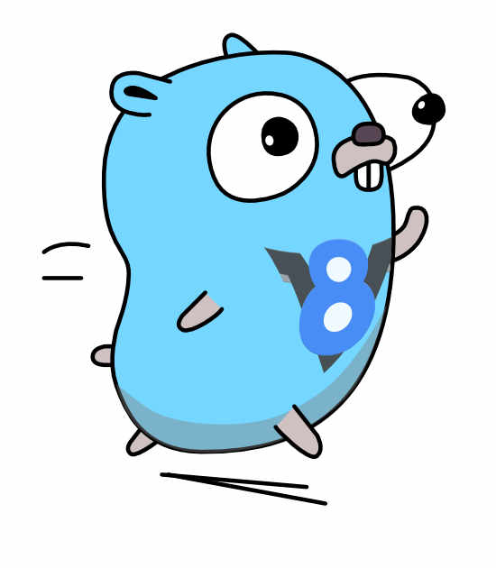

# Execute JavaScript from Go

<a href="https://github.com/rogchap/v8go/releases"></a>
[](https://goreportcard.com/report/rogchap.com/v8go) 
[](https://pkg.go.dev/rogchap.com/v8go)
[](https://github.com/rogchap/v8go/actions?query=workflow%3ACI)

[](https://codecov.io/gh/rogchap/v8go)
[](https://app.fossa.com/projects/custom%2B22862%2Fgit%40github.com%3Arogchap%2Fv8go.git?ref=badge_shield)
[](https://gophers.slack.com/channels/v8go)



## Usage

```go
import "rogchap.com/v8go"
```

### Running a script

```go
ctx, _ := v8go.NewContext() // creates a new V8 context with a new Isolate aka VM
ctx.RunScript("const add = (a, b) => a + b", "math.js") // executes a script on the global context
ctx.RunScript("const result = add(3, 4)", "main.js") // any functions previously added to the context can be called
val, _ := ctx.RunScript("result", "value.js") // return a value in JavaScript back to Go
fmt.Printf("addition result: %s", val)
```

### One VM, many contexts

```go
iso, _ := v8go.NewIsolate() // creates a new JavaScript VM
ctx1, _ := v8go.NewContext(iso) // new context within the VM
ctx1.RunScript("const multiply = (a, b) => a * b", "math.js")

ctx2, _ := v8go.NewContext(iso) // another context on the same VM
if _, err := ctx2.RunScript("multiply(3, 4)", "main.js"); err != nil {
  // this will error as multiply is not defined in this context
}
```

### JavaScript function with Go callback

```go
iso, _ := v8go.NewIsolate() // create a new VM
// a template that represents a JS function
printfn, _ := v8go.NewFunctionTemplate(iso, func(info *v8go.FunctionCallbackInfo) *v8go.Value {
    fmt.Printf("%v", info.Args()) // when the JS function is called this Go callback will execute
    return nil // you can return a value back to the JS caller if required
})
global, _ := v8go.NewObjectTemplate(iso) // a template that represents a JS Object
global.Set("print", printfn) // sets the "print" property of the Object to our function
ctx, _ := v8go.NewContext(iso, global) // new Context with the global Object set to our object template
ctx.RunScript("print('foo')", "print.js") // will execute the Go callback with a single argunent 'foo'
```

### Update a JavaScript object from Go

```go
ctx, _ := v8go.NewContext() // new context with a default VM
obj := ctx.Global() // get the global object from the context
obj.Set("version", "v1.0.0") // set the property "version" on the object
val, _ := ctx.RunScript("version", "version.js") // global object will have the property set within the JS VM
fmt.Printf("version: %s", val)

if obj.Has("version") { // check if a property exists on the object
    obj.Delete("version") // remove the property from the object
}
```

### JavaScript errors

```go
val, err := ctx.RunScript(src, filename)
if err != nil {
  e := err.(*v8go.JSError) // JavaScript errors will be returned as the JSError struct
  fmt.Println(e.Message) // the message of the exception thrown
  fmt.Println(e.Location) // the filename, line number and the column where the error occured
  fmt.Println(e.StackTrace) // the full stack trace of the error, if available

  fmt.Printf("javascript error: %v", e) // will format the standard error message
  fmt.Printf("javascript stack trace: %+v", e) // will format the full error stack trace
}
```

### Terminate long running scripts

```go
vals := make(chan *v8go.Value, 1)
errs := make(chan error, 1)

go func() {
    val, err := ctx.RunScript(script, "forever.js") // exec a long running script
    if err != nil {
        errs <- err
        return
    }
    vals <- val
}()

select {
case val := <- vals:
    // sucess
case err := <- errs:
    // javascript error
case <- time.After(200 * time.Milliseconds):
    vm, _ := ctx.Isolate() // get the Isolate from the context
    vm.TerminateExecution() // terminate the execution 
    err := <- errs // will get a termination error back from the running script
}
```

## Documentation

Go Reference & more examples: https://pkg.go.dev/rogchap.com/v8go

### Support

If you would like to ask questions about this library or want to keep up-to-date with the latest changes and releases,
please join the [**#v8go**](https://gophers.slack.com/channels/v8go) channel on Gophers Slack. [Click here to join the Gophers Slack community!](https://invite.slack.golangbridge.org/)

### Windows

In order to build a project using v8go on Windows, Go requires a gcc compiler to be installed.

To set this up:
1. Install MSYS2 (https://www.msys2.org/)
2. Add the Mingw-w64 bin to your PATH environment variable (`C:\msys64\mingw64\bin` by default)
3. Open MSYS2 MSYS and execute `pacman -S mingw-w64-x86_64-toolchain`

V8 requires 64-bit on Windows, therefore it will not work on 32-bit systems. 

## V8 dependency

V8 version: **9.0.257.18** (April 2021)

In order to make `v8go` usable as a standard Go package, prebuilt static libraries of V8
are included for Linux, macOS and Windows ie. you *should not* require to build V8 yourself.

Due to security concerns of binary blobs hiding malicious code, the V8 binary is built via CI *ONLY*.

## Project Goals

To provide a high quality, idiomatic, Go binding to the [V8 C++ API](https://v8.github.io/api/head/index.html).

The API should match the original API as closely as possible, but with an API that Gophers (Go enthusiasts) expect. For
example: using multiple return values to return both result and error from a function, rather than throwing an
exception.

This project also aims to keep up-to-date with the latest (stable) release of V8.

## License

[](https://app.fossa.com/projects/custom%2B22862%2Fgit%40github.com%3Arogchap%2Fv8go.git?ref=badge_large)

## Development

### Upgrading the V8 binaries

This process is non-trivial, and hopefully we can automate more of this in the future.

1) Make sure to clone the projects submodules (ie. the V8's `depot_tools` project): `git submodule update --init --recursive`
1) Add the `depot_tools` folder to your `PATH` eg: `export PATH=~/Development/rogchap/v8go/deps/depot_tools:$PATH`
1) From the `deps` folder run `fetch v8`; you only need to do this once, if you don't already have the V8 source.
1) Find the current stable release (`v8_version`) here: [https://omahaproxy.appspot.com](https://omahaproxy.appspot.com)
1) Create a new git branch from `master` eg. `git checkout -b v8_7_upgrade`
1) Enter the v8 folder and fetch all the latest git branches: `cd deps/v8 && git fetch`
1) Find the right `branch-heads/**` to checkout, for example if the `v8_version` is 8.7.220.31 then you want to `git checkout
branch-heads/8.7`. You can check all the `branch-heads` with `git branch --remotes | grep branch-heads/`
1) Copy all the contents of `deps/v8/include` to `deps/include` making sure not to delete any of the `vendor.go` files,
which are required for users that are using `go mod vendor`. If there are any new folders added, make sure to create new
`vendor.go` files in each folder within `deps/include` and update `cgo.go`.
1) Optionally build the V8 binary for your OS: `cd deps && ./build.py`. V8 is a large project, and building the binary
can take up to 30 minutes. Once built all the tests should still pass via `go test -v .`
1) Commit your changes, making sure that the git submodules have been updated to the new checksum for the version of V8.
Make sure *NOT* to add your build of the binary, as this will be build via CI.
1) Because the build is so long, this is not automatically triggered. Go to the [V8
Build](https://github.com/rogchap/v8go/actions?query=workflow%3A%22V8+Build%22) Github Action, Select "Run workflow",
and select your pushed branch eg. `v8_7_upgrade`.
1) Once built, this should open 3 PRs against your branch to add the `libv8.a` for Linux, macOS and Windows; merge
these PRs into your branch. You are now ready to raise the PR against `master` with the latest version of V8.

### Formatting

Go has `go fmt`, C has `clang-format`. Any changes to the `v8go.h|cc` should be formated with `clang-format` with the
"Chromium" Coding style. This can be done easily by running the `go generate` command.

`brew install clang-format` to install on macOS.

---

V8 Gopher image based on original artwork from the amazing [Renee French](http://reneefrench.blogspot.com).
